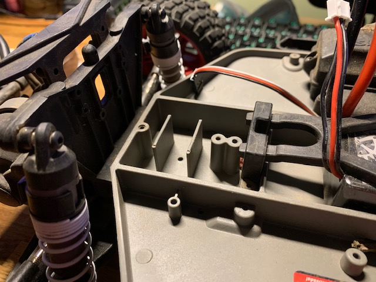
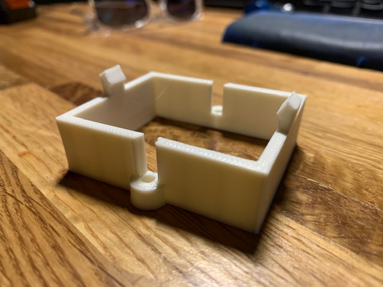
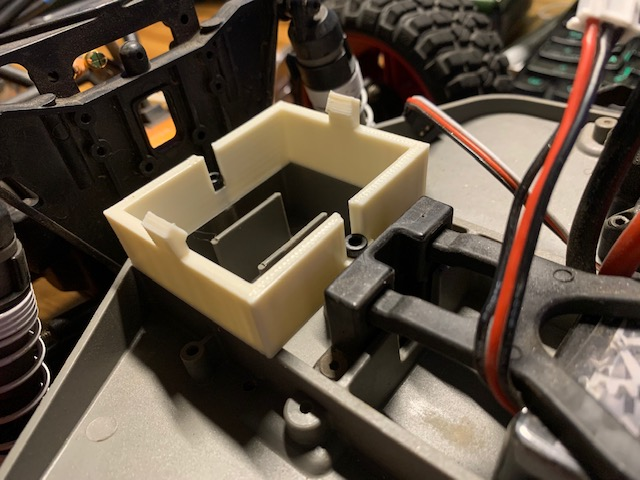
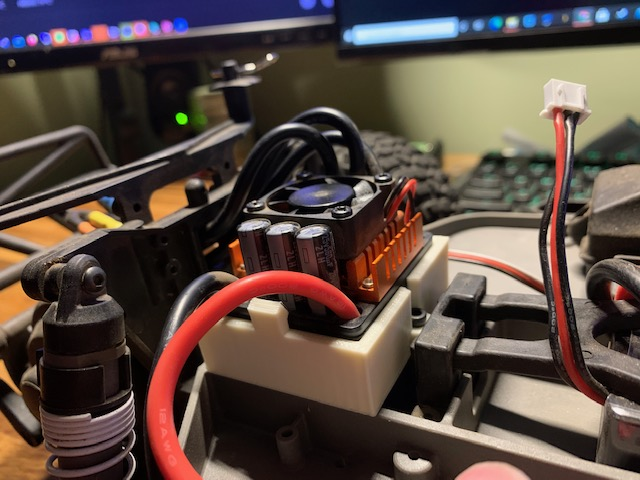

# Brushless ESC Bracket for 2WD Traxxas Slash

The [2WD Traxxas Slash](https://traxxas.com/products/models/electric/58034-1slash) is a great entry point for 1/10 scale RC trucks. It has a solid chassis and is *relatively* inexpensive.

Wanting a bit more power, but not wanting to spend too much money, I decided to purchase a [Brushless Motor/ESC Kit](https://amzn.to/323WqeT) from Amazon. The motor/ESC combo are far more powerful than the stock hardware, but the ESC has no obvious mounting features.

When doublestick tape was no longer enough I decided to design a **Brushless ESC Bracket for 2WD Traxxas Slash**.

## What is it?

[TraxxasSlashESCMount.STL](TraxxasSlashESCMount.STL) is an easy-to-print mounting bracket for the [RCRunning B3650](https://amzn.to/323WqeT) ESC which fits perfectly atop the Traxxas Slash's 48mm mounting bosses. 

## Features
- Securely holds the ESC during bashing
- Does not interfere with airflow
- Does not interfere with cable passage to the motor
- Mounts with the same screws as the factory ESC
- Allows for tool-less maintenence of the ESC
- Easy to print design requires no supports during FDM printing

## Pictures

