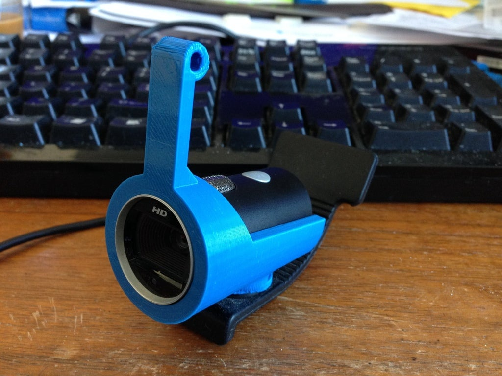
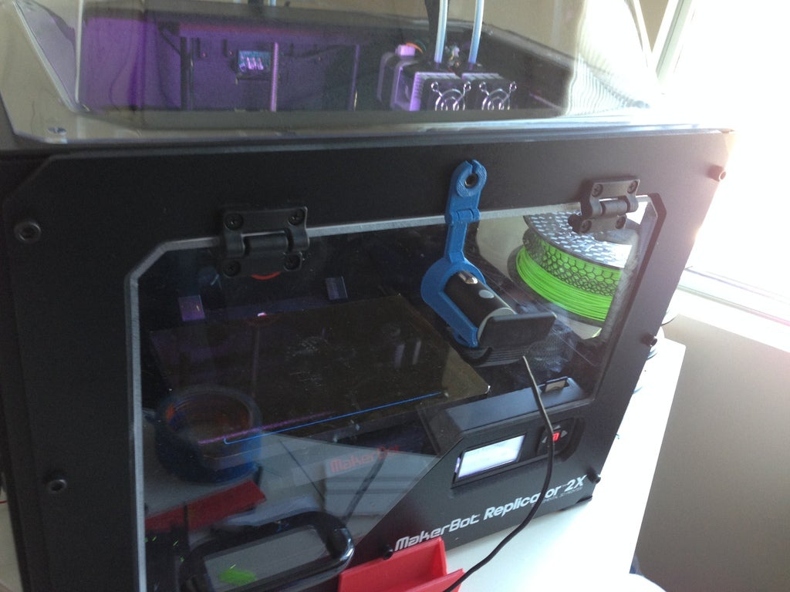
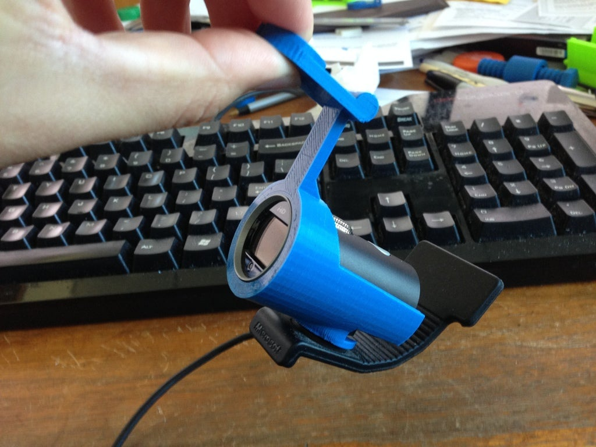

# Hinged Webcam Mount for Makerbot 2 for Lifecam Camera

I wanted to run a streaming camera so I could watch my prints remotely. The camera should be oriented so I always see the active area being printed, and so that it's not in the way when I open the door. I designed this **Hinged Webcam Mount for Makerbot 2 for Lifecam Cinema**.

## What is it?

This is a 3D printable mount designed to hang your Microsoft Lifecam Cinema from the front of your Makerbot 2.

## Features

- Hinged design allows you top open and close the door without removing the camera.
- Press-fit screw bracket allows for tool-less install.

## Download

- Screw Bracket: [CameraMount-Bracket.STL](CameraMount-Bracket.STL?raw=1)
- Camera Holder: [CameraMount-Holder.STL](CameraMount-Holder.STL?raw=1)

## Pictures

