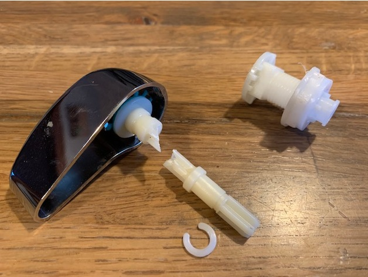
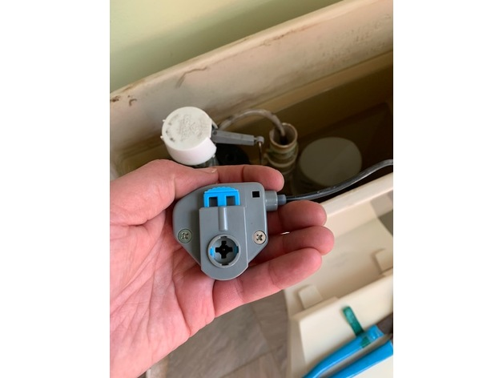
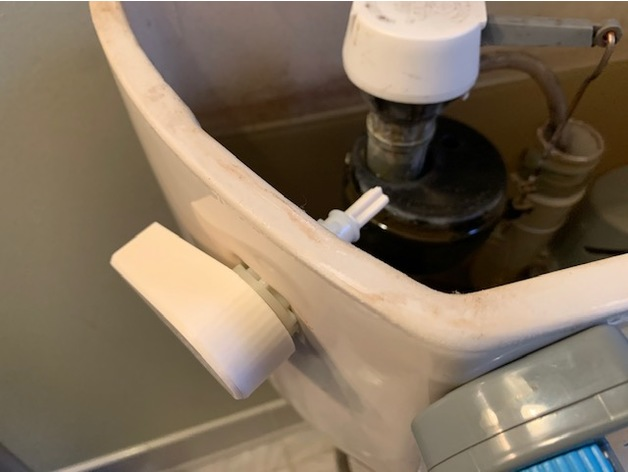
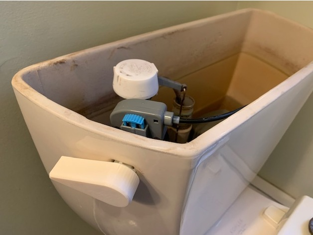

# HydroStop Replacement Flush Lever

The flush lever on my Danco HydroStop toilet flush mechanism snapped. Parts for this system are not available except by contacting the manufacturer. The lever itself uses a plastic actuator arm seemingly designed to fail.

Rather than replace the whole mechanism I designed a **HydroStop Replacement Flush Lever**

## What Is It?

Here is 3d printable replacement flush lever for your Danco HydroStop flush mechanism. Designed to fit within the factory provided mounting hardware.

## Download

- [HydroStop-Replacement-Lever-STL.STL](HydroStop-Replacement-Lever-STL.STL?raw=1)

## Pictures

