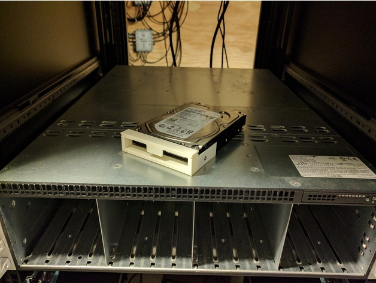
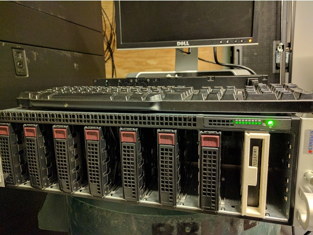
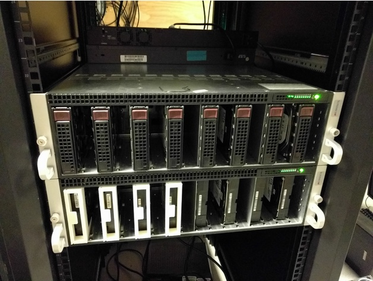

# Replacement Drive Caddy for Supermicro H8TRF

I needed to fire up an older Supermicro blade chassis, but we'd lost or discarded the disk caddies. So I designed a **Replacement Drive Caddy for Supermicro H8TRF** in OpenScad.

## What is it?

This is a rudimentary disk caddy for an 8-blade server Supermicro server chassis. The caddy is designed simply to support the front of the drive letting the sata connector support the rear. As far as I know it should fit any H8TRF.

## Pictures

