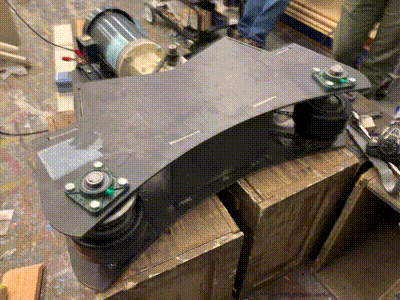

# Turntable Traction Drive Project

<image alt="Design Render" src="images/design-render.jpg" width=600 />

This is my design for a Turntable Traction Drive. It's meant to turn a large theatrical turntable covered in sets and actors in a safe reliable way. It can be built for less than $3000 USD.

I was inspired to take on this project by Alan Hendrickson's chain-driven design featured in [Technical Designs Solutions for Theatre Volume 2 (Sammler/Harvey 2002)](https://www.amazon.com/Technical-Design-Solutions-Theatre-Collection/dp/0240804929). His design shows that a chain drive can rotate a turntable. I was interested in designing an easier-to-integrate "bolt-on" solution.

Feel free to make your own or iterate on this in any way permitted by the [license](../LICENSE)! If you do happen to build one, send me a picture, I'd love to share it!

## Resources

- [Parts Overview](TurntableTractionDrive-PartsOverview.pdf)
- [Custom Part DXFs](dxfs/)
- [Bill Of Materials](BOM.md)
- [License (Creative Commons Attribution 4.0 International)](../LICENSE)
- [Initial Bench Test (video)](https://youtu.be/k4kjQTp1Dig)
  
  

- [Startup Run (video)](https://youtu.be/NJ8Oi7qZh6Y)

  

- [High Speed Run (video)](https://youtu.be/5Oqq8lbxnWo)

  

## Turntable Traction Drive Specifications

| Traction Drive Feature |  Detail |
| -------------- | ------------------------------|
| Design Units | **INCHES** |
| Height | 9.875" |
| Width | 32.875" |
| Depth |  33" |
| Chassis Weight | ~112 Lbs |
| Total Weight | ~228 Lbs |
| Number of Parts | 60 |
| Minimum Turntable Size | 7' Diameter |
| Maximum Turntable Size | Proven on a 23' diameter Turntable with steel and wood scenery. |

### Powerplant Details

My motor decision was based on what I had lying around. You may easily sub in your own motor, but for simplicity of integration try to pick a motor matching NEMA Frame 145TC. Otherwise you may have to drill new holes in the `Base Plate` and `Motor Gusset`.

| Powerplant Feature |  Detail |
| -------------- | ------------------------------|
| Model | General Electric 2HP TEFC (5KE48WN8167) |
| Speed | 1725 RPM at 60Hz |
| Layout | NEMA Frame 145TC |
| Gearhead | Morse 175Q140LR5 |
| Gearhead Ratio | 5:1 |

### Control Details

In order to vary the speed of drive motor we must use a Variable Frequency Drive (VFD). The VFD will be responsible for managing the speed and acceleration of the traction drive. Choosing the right motor controller is therefore key to the reliability and safety of the system. 

| VFD Feature |  Detail |
| -------------- | ------------------------------|
| Model | Hitachi L-100 (L100-007NFU)  |
| Input Power | 120VAC 15A |
| Output Power | 0.75 KW (1 HP) |
| Output Range | 0 - 360Hz |

### Bill Of Materials

I've tried to use off-the-shelf parts as much as possible in order to make this design accessible. 

A Complete Bill Of Materials is available here: [Bill Of Materials](BOM.md)

## Design

Staples Players was looking for a way to add some automation and motion to its production of Disney's Descendants The Musical. I was interested in creating a solution which could be applied generically to any of the typical turntable configurations they use.

I decided to make a drive unit to rotate a turntable by applying a traction wheel against the edge of the table. Such a device would be easy to integrate in most sets where the turntable sits on top of the stage floor.

### Mechanical Considerations

Using drive wheels to turn a turntable seemed pretty straight forward. I'm pretty sure I've seen carnival rides driven in this manner. As a gut-check I did a bit of marketplace research and found that such devices do exist.

<image alt="Concept" src="images/initial-concept.png" width=600 />

My first idea was to use a motor with a gear reduction and a triangular chain configuration. The friction wheels would be pneumatic tires. The idea was that an idler would pull the chain away from the contact-point of the turntable and allow for easy tensioning of the chain system. However, preliminary research indicated two things: First, chains don't like to be run horizontally they prefer to run vertically. Second, a triangular configuation would result in an uneven distribution of power between the two drive wheels.

<image alt="Design Layout" src="images/design-layout.jpg" width=400 />

Moving away from the single-chain configuration I moved towards a centrally mounted motor with two chains, one going to each drive shaft. I also ditched the idea of pneumatic wheels and prefering instead an off-the-shelf keyed drive roller from McMaster. This simplified sourcing and answered the question: How do I attach the drive shaft to the wheel.

<image alt="Design Render" src="images/design-render.jpg" width=400 />

With those two decisions made the next step was to make a design in Fusion 360 and start selecting components. I started with the power source. I was eager to use a motor I had sitting on the shelf: A 3 Phase 2HP GE Motor (NEMA Frame 145TC. GE Model 5KE48WN8167) with a Morse 5:1 right-angle gear reduction (Morse 175Q140LR5.) This is a fairly beefy motor with a significant gear reduction.

|    |  Motor Shaft | Gear Box Output | Output Wheel |
| -- | ------ | -- | -- |
| Ratio | 1:1 (1.0) | 5:1 (.20) | 11:30 (.36) |
| RPM @ 60Hz | 1725 RPM | 345 RPM | 124 RPM |

In addition to the gear reduction on the front-end of the motor, I wanted to further reduce the gearing for two reasons: First, turntables typically require a large amount of effort to break free when turning. Reduced gearing would permit greater starting torque. Second, the native speed of the motor and gearing is 345 RPM (1725 RPM / 5). We want the traction drive gearing to allow us to use as much of the 0-60Hz range of the motor as possible without spinning a turntable too quickly. Therefore care was taken to use a small drive sprocket (11 teeth), a large axle-sprocket (30 teeth), and a small drive wheel (6" diameter".)

| Effective Speed Math | |  |
| -- | -- | -- |
| Drive Wheel Circumference (feet) | 2π * .25' | 1.57' Foot Circumference |
| Linear Feet Per Minute | 124 RPM * 1.57' | 194 Feet Per Minute |
| 7' Diameter Turntable Max Speed | 194 FPM ÷ 22' | 8.8 RPM |
| 16' Diameter Turntable Max Speed | 194 FPM ÷ 50' | 3.8 RPM |
| 24' Diameter Turntable Max Speed | 194 FPM ÷ 75' | 2.6 RPM |

**Integration Note:** *If you find that the drive speed is not large enough for your large turntable design, your best bet, depending on your choise of motor and VFD, is to overdrive the motor past 60Hz. (Most VFDs let you run up to 360Hz, but you will want to check your motor and drive documentation first.) Alternatively you could swap out the 6" drive wheels for a larger diameter wheel, but be aware that this will reduce the available startup torque.*

<image alt="Right Bearing Gusset" src="images/right-gusset.jpg" width=400 />

The Turntable Traction Drive is designed to sit on a flat surface. Because of this I couldn't through-bolt the pillow block bearings. That means that the steel would have to be drilled and tapped. Because the steel is only 1/4" I would need additional thickness on the bottom layer in order to have appropriate thread engagement. To resolve this, I designed three "gusset" parts: Two supporting the lower bearings and one supporting the motor mount. They are meant to be welded down then drilled and tapped, such that the threads are continuous.

### Turntable Eccentricity

Turntables aren't perfect circles, and they're not always perfectly centered, so I needed somehow to keep the machine pressed against the side of the turntable even if it's out-of-true. I designed the machine with four 200lb springs which could be set to provide significant preload against the side of the turntable. 

<image alt="Pusher Springs" src="images/pusher-plate.jpg" width=400 />

The springs are held captive by a 5/16" bolt welded to the pusher plate. The springs press against a piece of 1.5" angle iron which is lag-bolted through the two slots to the stage floor. This allows the whole machine to slide back and forth in response to bulges or dips in the circumference of the turntable.

<image alt="Ratchet Straps" src="images/ratchet-straps.jpg" width=400 />

When testing we found that a far simpler solution was to use ratchet straps to draw the machine up against the side of the turntable and hold it there. Ratchet straps have some natural elasticity and therefore provide similar preload to a spring-based solution with substantially easier integration. (We can turn a large turntable witout even bolting the machine to the deck!)

### Chain Tension

Chain based system must be kept in tension to keep the chain from slipping off the drive sprocket. In order to apply tension to the system we mounted the drive motor on top of an adjustable sled from McMaster. However, we noticed too late that the sled is meant to adjust the position of a motor mounted perpendicularly to the track of the sled. My design called for the motor to be mounted parallel with the track.

<image alt="Motor Modifications" src="images/motor-mods.jpg" width=200 />

In order to mount the motor in this orientation we had to drill two additional holes in the motor's NEMA 146TC mounting plate. Once drilled we could use the drive seld to tension the chain and then crank down the motor bolts to lock it in place.

### Material

Because I didn't know how much force would be required to turn a loaded-turntable I wasn't able to do any real load calculations. Without this knowlege it seemed the best bet was to over-build the system. So I designed around plasma-cut 1/4" A36 mild steel. 

<a href="TurntableTractionDrive-PartsOverview.pdf"><image alt="Steel Order" src="images/design-sample.jpg" width=400 /></a>

I made a tab-and-slot design such that when assembled the machine would (hopefully) hold itself square long enough for me to weld it together. I allowed for 1/16th of clearance between my tabs and my slots and verified that the steel shop could hold 1/16 tolerance during plasma cutting. Their advice was that as long as no holes were smaller than 0.25" they should have no problems holding 1/16" tol.

<image alt="Steel Order" src="images/steel-qa.jpg" width=400 />

I provided the steel shop with a flat DXF file for each part with **INCHES** as the unit. They sent me back some fully dimensioned scans for me to verify.

<image alt="Parts Fitup" src="images/parts-fitup.jpg" width=400 />

Chapin and Bangs in Bridgeport, CT made the steel parts. They were made out of A36 steel, plasma cut, delivered dry. The cost was $810 with delivery.

<image alt="Initial Welds" src="images/initial-welds.jpg" width=400 />

The biggest problem with 1/4" steel is that my welder is only barely powerful enough to weld it. I ended up using .030 flux-core wire. Flux-core welds don't look great but they're plenty strong and I was able to get reasonable penetration even with my wimpy 120VAC welder.

## Assembly

Assembly took two days, with the majority of time being spent drilling and tapping holes. All bolt holes are undersized for 3/8-24 with the idea being that plasma-cut holes are not very accurate so it's better to drill them after the fact and then tap the perfectly drilled holes. This worked fairly well but we broke plenty of bits and taps.

<image alt="Drilling and Tapping" src="images/drilling-tapping.jpg" width=400 />

We found that the steel fit together perfectly on the day it arrived, but on the second day the top plate no longer fit perfectly on the welded-up sides. It seems like everything moved a little bit as it cooled down from being welded and this caused us some difficulty in assembly. Next time around we will weld the whole machine in a single session. Or perhaps keep the top tacked after the bottom is assembled.

<image alt="Right Drive Wheel" src="images/bottom-chain.jpg" width=300 />

The right-angle (Left/Right AKA Top/Bottom) configuration of the gear-reducer allows us to run one sprocket on top and another sprocket on the bottom. This is useful since 7/8" ID sprockets are quite beefy. Too beefy to fit both chains on a single output shaft from the gear-reducer. For the right-hand drive wheel we connected a ANSI #40 chain to an 11 tooth sprocket mounted on the bottom shaft.

<image alt="Left Drive Wheel" src="images/top-chain.jpg" width=400 />

On the left-hand of the machine we ran chain from a sprocket mounted on the top shaft of the gear-reducer. On this machine the chain is a bit too close to the top plate. In our next revision we'll try to lower the motor 1/4" by eliminating the motor gusset.

## Integration

### Safety

As it's intended use involves live actors on a rotating stage, safety must be considered seriously. 

:warning: **The Turntable Traction Drive is a dangerous machine. Using it should not be taken lightly. Caution and care must be taken in every integration to ensure that safe operating parameters are configured.**

A turntable may pose a hazard on set even when operated manually by backstage technicians, however, unlike backstage technicians this machine has no brain. It doesn't know to stop because a piece of scenery is late during a scene-shift. It is not context-aware. Also, unlike a backstage technician, under the right circumstances this machine can summon inhuman amounts of torque.

:warning: **Due to its power and remoteness this machine is not designed as part of an automation system. Rather, it is intended to be manually operated by a user with a clear view of the turntable.**

As some risk is unavoidable, my analysis will focus on mitigation strategies.

| Risk | Mitigation Strategy |
| -- | -- |
| Electrical shock hazard | **Requirements:** Ground VFD appropriately to input mains. Ground motor appropriately to VFD. Ground chassis appropriately to the motor chassis. |
| Pinching hazards from rotating internal equipment and rotating top sprocket |  **Requirements:** Turntable Traction Drive must be in a fully enclosed secure area during operation. |
| Pinching/Crushing hazards between traction wheels and turntable edge | **Requirements:** Interface between the turntable and the traction drive must be fully enclosed during operation. |
| Risk of unexpected start | **Requirements:** Enable Unattended Start Protection in VFD by setting `c04` to `13` and short `P24` to `PIN 4` |
| Risk of fall due to sudden acceleration | Use conservative values for `f01`, `f02`, and `f03`. |
| Risk of fall due to overspeed | Set a conservative hard frequency limit using `a61` |
| Risk of crushing | #UNKNOWN# Investigate `B_12` and current overload protection. |
| Risk of crushing because of external scenery-based crush points. | **Requirements:** Turntables must maintain a raidal safety margin sufficient to prevent a person from being caught between a rotating piece of scenery and an adjacent non-rotating piece of scenery. Emergency Stop button must located near the turntable. Cast and crew must be trained on the location of the e-stop button. |
| Risk of entanglement | **Requirements:** Operator must have a clear view of the turntable. Emergency Stop button must located near the turntable. Cast and crew must be trained on the location of the e-stop button. |
| Risk of operator/integrator ignorance | **Requirements:** All safety requirements and warnings must be clearly printed on a label applied to the machine. Documentation must be made available. |

### Liability

This design is available for use under the [Creative Commons Attribution 4.0 International license](../LICENSE). By using this design you agree to the terms of this license.

The license includes the following language, which you should read:

    Section 5 -- Disclaimer of Warranties and Limitation of Liability.

      a. UNLESS OTHERWISE SEPARATELY UNDERTAKEN BY THE LICENSOR, TO THE
         EXTENT POSSIBLE, THE LICENSOR OFFERS THE LICENSED MATERIAL AS-IS
         AND AS-AVAILABLE, AND MAKES NO REPRESENTATIONS OR WARRANTIES OF
         ANY KIND CONCERNING THE LICENSED MATERIAL, WHETHER EXPRESS,
         IMPLIED, STATUTORY, OR OTHER. THIS INCLUDES, WITHOUT LIMITATION,
         WARRANTIES OF TITLE, MERCHANTABILITY, FITNESS FOR A PARTICULAR
         PURPOSE, NON-INFRINGEMENT, ABSENCE OF LATENT OR OTHER DEFECTS,
         ACCURACY, OR THE PRESENCE OR ABSENCE OF ERRORS, WHETHER OR NOT
         KNOWN OR DISCOVERABLE. WHERE DISCLAIMERS OF WARRANTIES ARE NOT
         ALLOWED IN FULL OR IN PART, THIS DISCLAIMER MAY NOT APPLY TO YOU.

      b. TO THE EXTENT POSSIBLE, IN NO EVENT WILL THE LICENSOR BE LIABLE
         TO YOU ON ANY LEGAL THEORY (INCLUDING, WITHOUT LIMITATION,
         NEGLIGENCE) OR OTHERWISE FOR ANY DIRECT, SPECIAL, INDIRECT,
         INCIDENTAL, CONSEQUENTIAL, PUNITIVE, EXEMPLARY, OR OTHER LOSSES,
         COSTS, EXPENSES, OR DAMAGES ARISING OUT OF THIS PUBLIC LICENSE OR
         USE OF THE LICENSED MATERIAL, EVEN IF THE LICENSOR HAS BEEN
         ADVISED OF THE POSSIBILITY OF SUCH LOSSES, COSTS, EXPENSES, OR
         DAMAGES. WHERE A LIMITATION OF LIABILITY IS NOT ALLOWED IN FULL OR
         IN PART, THIS LIMITATION MAY NOT APPLY TO YOU.

In plain language: **I don't guarantee that this design works as intended, and I am not liable for any harm resulting from your use of this design.**

## VFD Configuration

**Note:** These notes are only really useful for the Hitachi L-100. If you're using another VFD consult your documentation.

`P24` provides a 24V field reference voltage for use when powering the Control Terminals.

When configured correctly we desire the following outcome:

- To tell the turntable to run forward short `P24` to `PIN 1`.
- To tell the turntable to run in revers short `P24` to `PIN 2`.

### VFD Parameters

| Parameter | Value | Notes |
| -- | -- | -- |
| `a01` | `00` | `00`=Keypad/Potentiometer, `01`=Control Terminals, `02`=F01 Settings |
| `a02` | `02` | `01`=Control Terminals, `02`=Keypad Run Key |
| `a02` | `02` | `01`=Control Terminals, `02`=Keypad Run Key |
| `a61` | `60` | Set a hard limit on the output frequency of the VFD to never overdrive the motor. |
| `a04` | `60` | Set the "Base" Frequency. (The frequency at which the VFD emits full voltage) |
| `a05` | `60` | Set the "Max" Frequency (The frequency allowed during manual opeation) |
| `a97` | `00` | Set the Acceleration Curve: `00`=Linear, `01`=S-Curve |
| `a97` | `00` | Set the Deceleration Curve: `00`=Linear, `01`=S-Curve |
| `c01` | `00` | Configure Terminal 1: `00`=Run Forward
| `c02` | `01` | Configure Terminal 2: `01`=Run Reverse
| `f01` | `nn` | **Set the target frequency** |
| `f02` | `nn` | **Set the acceleration time** (The number of seconds it should take to get spin-up from 0Hz to `f01`Hz) |
| `f03` | `nn` | **Set the deceleration time** (The number of seconds it should take to get spin-down from `f01`Hz to 0Hz) |
